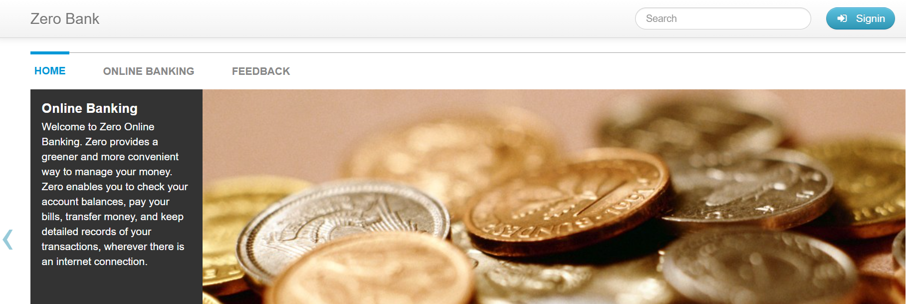

# QA Automation Project – Zero Bank

## 📌 Project Overview



This project is a **QA Automation and Testing Portfolio** focused on validating critical functionalities of the demo banking application **Zero Bank** ([http://zero.webappsecurity.com](http://zero.webappsecurity.com)).

The objective is to demonstrate **real-world QA practices** combining:

* Manual testing (documentation, scenarios, acceptance criteria)
* Automated UI testing using **Cypress**
* Professional project structure aligned with Agile/Scrum environments

This repository is designed to be easily reviewed by **QA Leads, Technical Interviewers, and Recruiters**.

---

## 🎯 Objectives

* Validate core banking user flows using automated tests
* Apply QA best practices: smoke tests, happy paths, and negative scenarios
* Demonstrate traceability between **User Stories → Acceptance Criteria → Test Scenarios → Automated Tests**
* Build a maintainable and scalable Cypress test framework

---

## 🧪 Scope of Testing

### Functional Areas Covered

* User Authentication (Login)
* Account Overview
* Navigation and basic UI validation

### Test Types

* Smoke Tests
* Happy Path Scenarios
* Negative and Edge Cases

---

## 🛠️ Tech Stack

* **Cypress** – End-to-end test automation
* **JavaScript**
* **Node.js / npm**
* **VS Code**

---

## 📁 Project Structure

```
QA-CYPRESS-ZERO-BANK
│
├── cypress/
│   └── e2e/
│       ├── login_smoke.cy.js
│       ├── login_happy_path.cy.js
│       └── login_negative.cy.js
│
├── docs/
│   ├── user_stories.md
│   ├── acceptance_criteria.md
│   └── test_scenarios.md
│
├── README.md
├── package.json
└── package-lock.json
```

---

## 🚀 How to Run the Tests

1. Install dependencies

```bash
npm install
```

2. Open Cypress Test Runner

```bash
npx cypress open
```

3. Run tests in headless mode

```bash
npx cypress run
```

---

## 📌 Test Environment

* **Application URL:** [http://zero.webappsecurity.com](http://zero.webappsecurity.com)
* **Environment:** QA / Demo
* **Browser:** Chrome (default)

---

## 📄 Documentation

All functional analysis and test design artifacts are available in the `/docs` folder:

* User Stories
* Acceptance Criteria
* Test Scenarios
* Bugs Report

---

## 👩‍💻 Author

**Diana Serrano**
QA Engineer (Junior)

This project is part of a continuous learning path in QA Automation.

---

## ✅ Notes

This is a demo application. No real financial data is used.

---

⭐ *Feedback and suggestions are welcome.*
